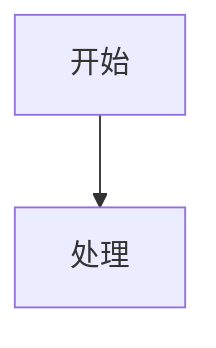

# Hugo 图表嵌入语法参考

本仓库使用 2 种嵌入方式：代码块内嵌和图片语法引用外部文件。

## 代码块内嵌（推荐用于简短图表）

````markdown


```chart
{
  "type": "line",
  "data": { ... }
}
```

```drawio
<mxfile>...</mxfile>
```

```excalidraw
{
  "type": "excalidraw",
  ...
}
```
````

## 图片语法引用外部文件（推荐用于复杂/可复用图表）

```markdown


```

## 默认优先级

1. **简短图表** → 代码块（`mermaid`、`chart`/`chartjs`、`drawio`、`excalidraw`）
2. **较长或可复用** → 拆成外部文件，用图片语法引用

> **不要**使用 Shortcode 方式（`` 或 `...`）。

## Mermaid inline 校验要求

- 使用 inline Mermaid（围栏代码块）时，必须逐行仔细核对语法，并在交付前验证可正确渲染
- 若图较长、可复用、包含较多 `<br/>`、引号、复杂注释，可优先拆成外部 `.mermaid` 文件
- inline Mermaid 中尽量避免裸写 `<...>` 占位符；若必须保留，优先用引号包裹后再验证渲染结果

## 资源命名规范

新增资源放在同一年目录下，与文章编号同前缀：

```text
source/post/2025/
├── 2601.md              # 文章正文
├── 2601-flow.mermaid    # 流程图
├── 2601-arch.excalidraw # 架构图
└── 2601-perf.chart.json # 性能图表
```

## 图表说明要求

- 文件型图表的图片语法要写有意义的 alt 文本
- 正文中用 1-2 句说明"这张图帮读者看什么"

**示例：**

```markdown

*图 1：MPG 调度模型。M 是操作系统线程，P 是逻辑处理器，G 是待执行任务。*
```
