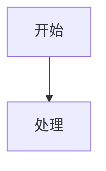

# Hugo 图表嵌入语法参考

本仓库支持 4 种嵌入方式：代码块内嵌、图片语法引用外部文件、Shortcode 引用外部文件、Shortcode 内联。

## 代码块内嵌（推荐用于简短图表）

````markdown


```chart
{
  "type": "line",
  "data": { ... }
}
```

```drawio
<mxfile>...</mxfile>
```

```excalidraw
{
  "type": "excalidraw",
  ...
}
```

```echarts
{
  "xAxis": { "type": "value" },
  "yAxis": { "type": "value" },
  "series": [{ "type": "line", "data": [...] }]
}
```

```echarts {extensions="gl"}
{
  "xAxis3D": { "type": "value" },
  "yAxis3D": { "type": "value" },
  "zAxis3D": { "type": "value" },
  "series": [{ "type": "surface", "data": [...] }]
}
```

```plotly
{
  "data": [{ "type": "scatter", "mode": "lines", "x": [...], "y": [...] }],
  "layout": { "title": "..." }
}
```

```plotly {extensions="gl3d"}
{
  "data": [{ "type": "surface", "x": [...], "y": [...], "z": [[...]] }],
  "layout": { "title": "..." }
}
```
````

## 图片语法引用外部文件（推荐用于复杂/可复用图表）

```markdown


```

图片标题里可以用 `{width=... height=... class=... style=... extensions=...}` 传参：

```markdown


```

## Shortcode 引用外部文件

在需要显式传参或复用文件时使用：

```markdown




```

## Shortcode 内联

```markdown

{
  "series": [{ "type": "surface", "data": [...] }]
}

```

## 默认优先级

1. **简短图表** → 代码块（`mermaid`、`chart`/`chartjs`、`drawio`、`excalidraw`、`echarts`、`plotly`）
2. **较长或可复用** → 拆成外部文件，用图片语法引用
3. **需要复用外部文件且图片语法不满足时** → Shortcode 引用外部文件
4. **需要在 Markdown 中保留结构化参数或嵌入非 JSON/文本内容时** → Shortcode 内联

> **推荐**：优先使用代码块或图片语法；Shortcode 仅在需要显式传参（如 `extensions="gl"`、`width`、`class`）或复用同一文件但渲染方式不同时使用。

## Mermaid inline 校验要求

- 使用 inline Mermaid（围栏代码块）时，必须逐行仔细核对语法，并在交付前验证可正确渲染
- 若图较长、可复用、包含较多 `<br/>`、引号、复杂注释，可优先拆成外部 `.mermaid` 文件
- inline Mermaid 中尽量避免裸写 `<...>` 占位符；若必须保留，优先用引号包裹后再验证渲染结果

## ECharts / Plotly.js 扩展声明

- ECharts 扩展是**增量加载**的：默认只加载核心包（含所有 2D 图表），3D 等扩展通过 `extensions="gl"` 声明后按需追加
- Plotly.js 的 partial bundle 之间**互相覆盖**全局 `Plotly`，无法叠加：默认加载最小包（`plotly-basic`），当页面同时出现最小特性图表和声明了扩展的图表时，加载器会自动升级到完整包

## 资源命名规范

新增资源放在同一年目录下，与文章编号同前缀：

```text
source/post/2025/
├── 2601.md                  # 文章正文
├── 2601-flow.mermaid        # 流程图
├── 2601-arch.excalidraw     # 架构图
├── 2601-perf.chart.json     # 性能图表
├── 2601-vis.echarts.json    # ECharts 图表配置
└── 2601-vis.plotly.json     # Plotly.js 图表配置
```

## 图表说明要求

- 文件型图表的图片语法要写有意义的 alt 文本
- 正文中用 1-2 句说明"这张图帮读者看什么"

**示例：**

```markdown

*图 1：MPG 调度模型。M 是操作系统线程，P 是逻辑处理器，G 是待执行任务。*
```
