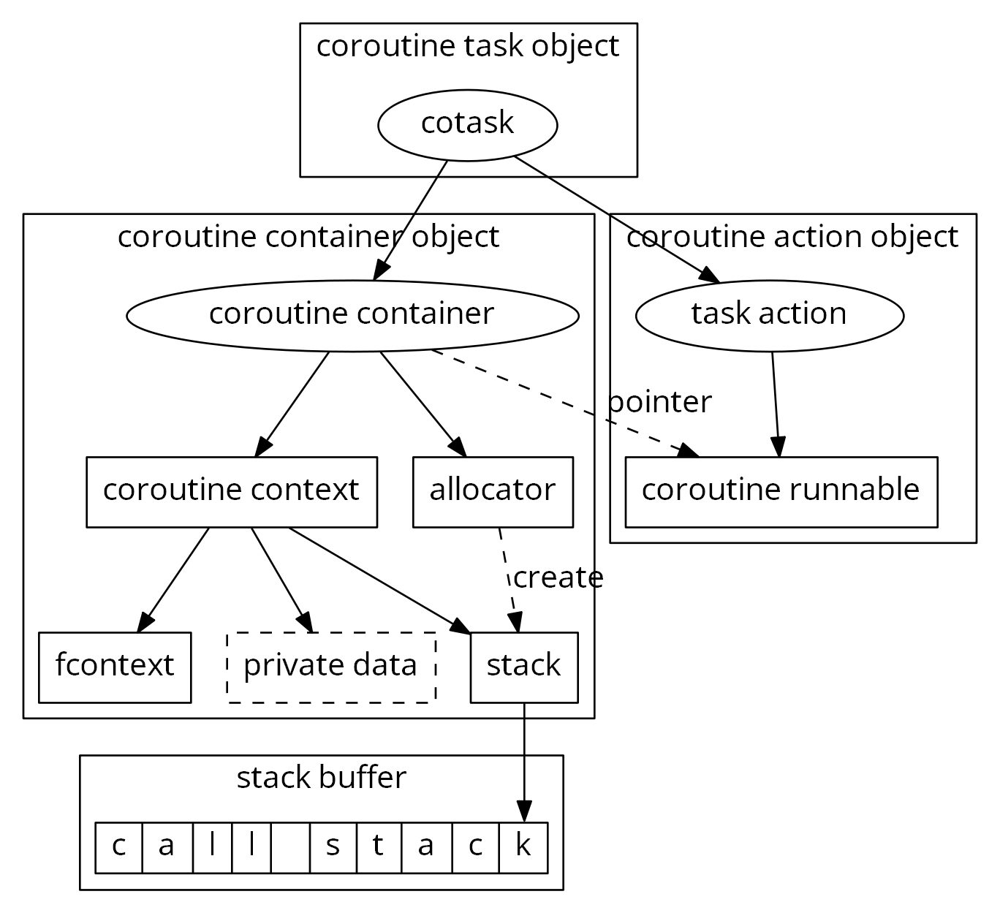
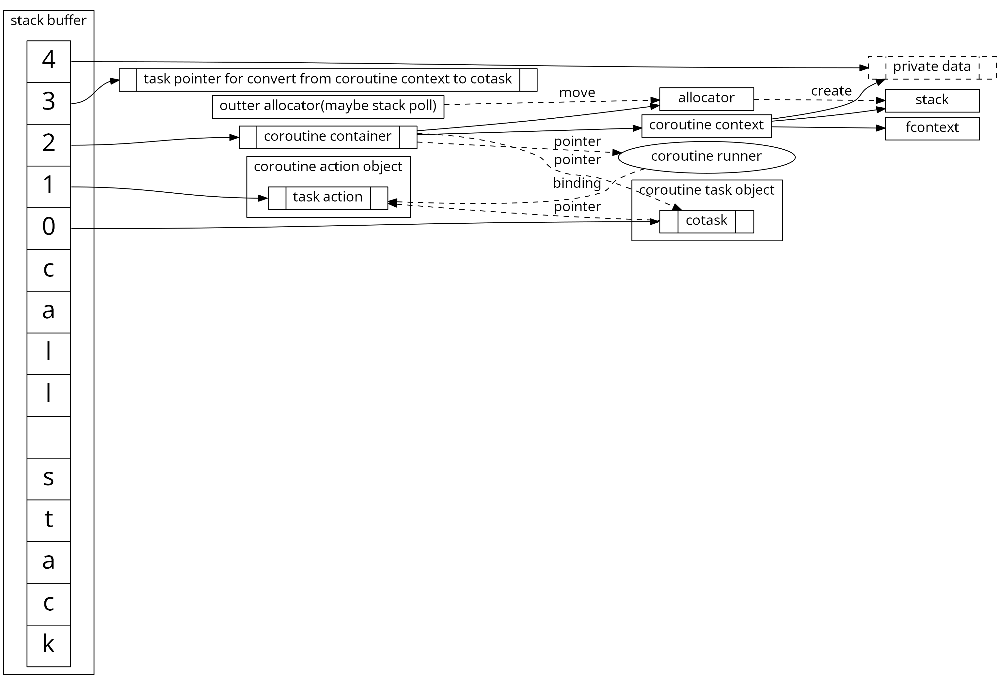

# 前言

年前就计划把以前项目的一些理念和设计方案融合到sample里来。但是内容比较多，一直也没太多时间去完成它。所幸虽然断断续续但终归是完成了。并且在之前的一些实现上还做了一些细节的优化。内容比较多我感觉我自己写的也比较乱，仅当作一个参照和小计吧。

# 协程系统优化

[libcopp][3]很早就实现完成了v2版本，现在迁移进[atsf4g-co/tree/sample_solution][2]以后也把v2分支正式并入了主干。原来的版本切出到v1分支并且停止维护了。

## libcopp v2内存布局

开发[libcopp][3] v2版本的最大目的是优化allocator的接口和内存碎片。

原来的allocator虽然是可定制的，但是是内置的。每次创建一个allocator对象，不同allocator之间共享数据只能通过全局数据或者TLS数据。现在则可以传入allocator了。这也是为后续的共享栈池做准备。

其次就是优化结构布局以优化内存碎片问题。在v1版本里，一个很重要的设计要点是各项组件可拆卸，就是说一些设计模式层面的东西比如协程任务、任务管理、等待和依赖关系等是可选的。同时栈分配器也可以是多种选择，采用系统地址映射加保护帧、采用malloc或者自定义分配器。为了各项组件尽可能解耦和易于组合，模块间较少采用组合关系，较多采用了引用关系，原来的协程任务结构大致上是这样的。

可以看得出来一个协程运行的时候对象数量很多。这样的话碎片也很多，虽然现代化的malloc实现能大幅缓解碎片问题，但是终归是有一些开销。所以v2版本在这方面就有了一系列优化。(注意执行栈是自顶向下增长)

## 栈池

## 性能对比

# 对象路由

统一续期、降级/升级、自动保活、定时保存

## 优化一： IO排队自动化

## 优化二： 快队列

# 设计细节优化

## 调度系统优化
不再需要全局container

## 统一异步指令流程

## etcd接入抽象层

## hostname判定优化

## simulator的优化和配置的时间单位
定时器机制、exec_cmd代替insert_cmd

# 优化方向

[1]: https://github.com/atframework/atsf4g-co/
[2]: https://github.com/atframework/atsf4g-co/tree/sample_solution
[3]: https://github.com/owt5008137/libcopp