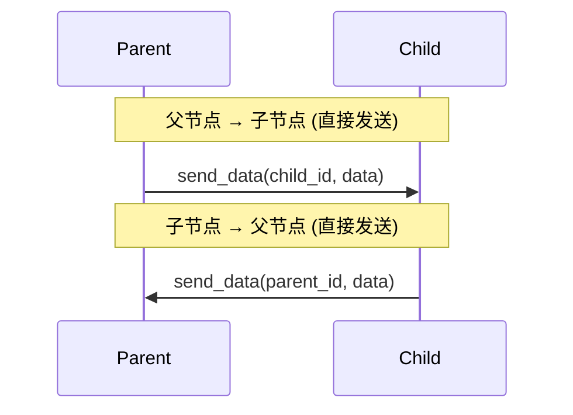
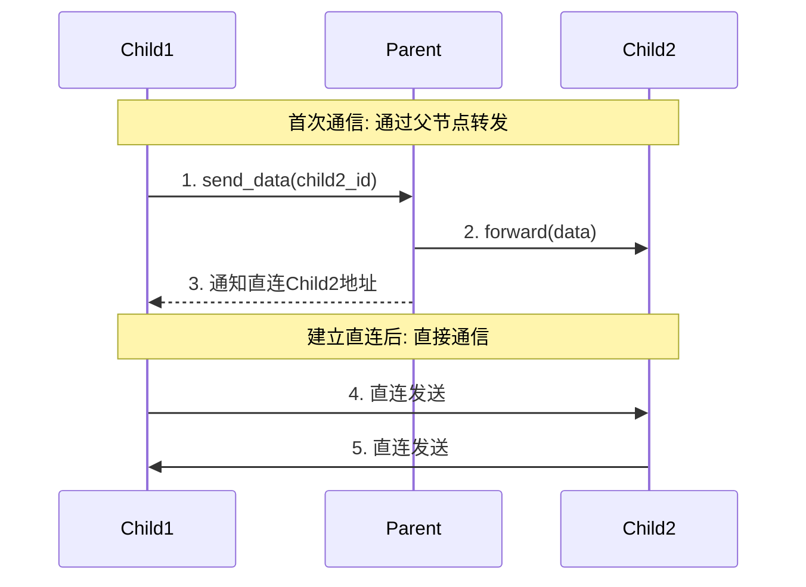
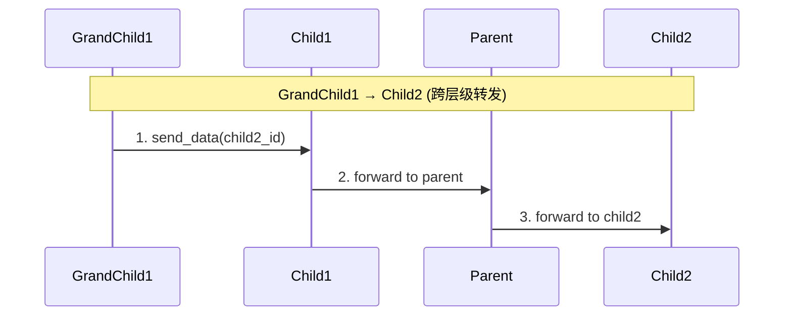
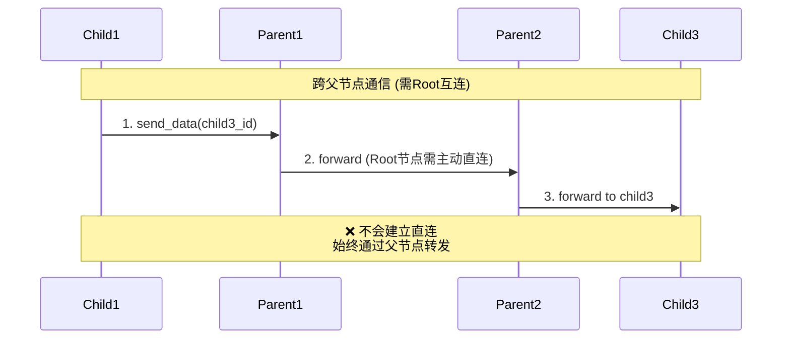
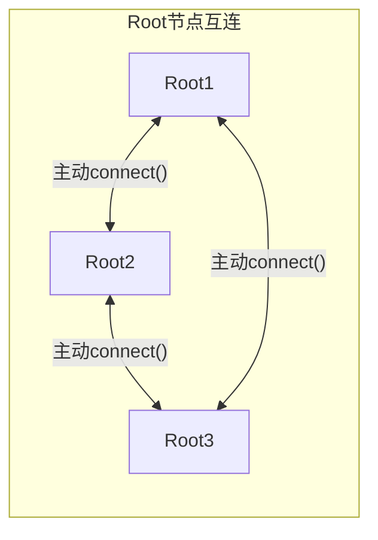
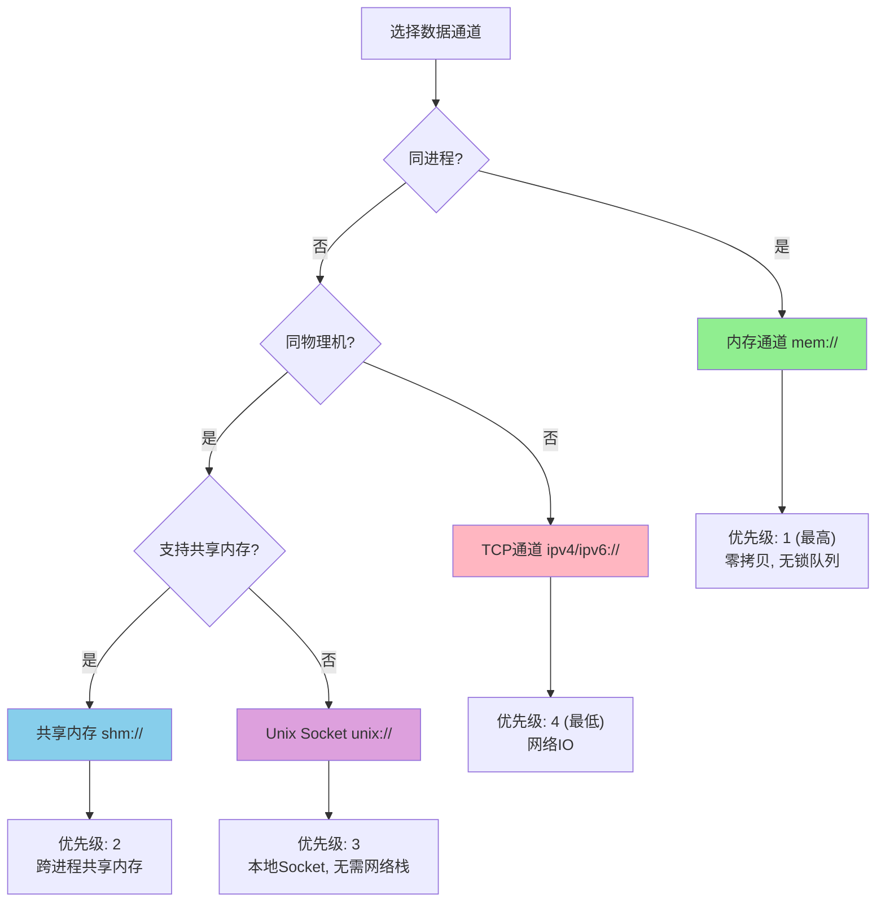

## 前言

很久很久以前，我为了解决以前项目中bus通信膨胀的问题设计了 [libatbus][libatbus], 当时主要解决的核心问题是解决大量服务器节点互通时服务器间两两建立通道时的大量内存浪费问题。也同时使用跨进程的无锁队列避免了多写单读场景下的加锁以提高性能。

当时也顺带实现了高性能的跨平台支持。

但是当时云原生还不流行，出海业务也较少。所以没有考虑出海跨大区网络抖动和质量很不稳定的问题。也没有过多地考虑动态代理层支持。
当时的想法是受网络路由的启发，实现了一个按固定网关和子网去管理的流程。这个流程好处是简单、快，算法层面就能算出路由去向，不需要外部服务发现的依赖。
虽然当时就支持多级代理，但是整体是一个树形结构。又因为是只实现了异步接口（为了保证高性能，不要因为谁偷懒写出卡住服务器的代码）。
所以整个框架冠以AT前缀（即Tree like - Async）。

但是现在云原生流行起来以后，如果想支持完全动态可以自动扩缩容的网关和代理层，且网关和代理层也可以无损HPA和迁移，那么就需要我们的代理支持网状结构。
也不得不引入外部的路由规则。

同时，出海场景的另一个问题是跨大区网络很不稳定。有些场景可以用专线缓解，但是专线死贵死贵。所以我们有些场景会走公网流量。
这就需要一方面隔离部分流量，防止部分网络不稳定影响整体服务健康，可以降级服务但不能不可用。另一方面走公网流量得部分也需要加强安全性，要走更严格的密钥协商和加密算法。

有一些其他解决方案，为了兼容老接口和流程，强行把云下的流程搬到云上（比如腾讯的tbuspp，给每个pod sidecar注入一个agent进程），其实一方面有额外不必要的负担，另一方面也反而丢失了原来设计上解决的一些通道管理上的问题。
我这次打算彻底整体重构 [libatbus][libatbus], 不考虑协议层向前兼容（大部分API还是得兼容）。可以在协议设计层面来解决掉这些问题。

本文主要关注于路由算法层面的改进。

## 之前的路由方案

### 核心设计思想

[libatbus][libatbus] 采用类似 IP 路由的树形结构设计，通过 **Bus ID** 和 **子网掩码** 来管理节点间的路由关系。


### 子网配置 (endpoint_subnet_conf)

每个节点可以配置一个或多个子网范围，通过 `id_prefix` 和 `mask_bits` 定义：

```cpp
struct endpoint_subnet_conf {
  ATBUS_MACRO_BUSID_TYPE id_prefix;  // 子网前缀
  uint32_t mask_bits;                // 后缀位数
};
```

例如，配置 `conf.subnets.push_back(atbus::endpoint_subnet_conf(0, 16))` 表示该节点可以管理后16位变化的所有子节点 ID。

### 路由规则

1. **父子关系判定**: 通过子网掩码计算，如果目标 ID 落在父节点的子网范围内，则为其子节点
2. **消息转发路径**:
   - 发送给子节点: 直接转发
   - 发送给兄弟节点: 通过父节点转发，父节点会通知兄弟节点建立直连
   - 发送给跨层级节点: 向上转发至公共祖先，再向下转发

#### 场景1: 父子节点直接通信



#### 场景2: 直接兄弟节点通信 (同父，会建立直连)



#### 场景3: 二级子节点转发



#### 场景4: 非直接兄弟节点 (不同父，不会自动直连)



#### 场景5: Root节点主动直连



Root节点之间没有父子关系，需要通过 `node->connect(address)` 主动建立连接。

### 通道选择优先级

根据通信双方的位置关系，自动选择最优通道：



#### 通道类型对比

| 通道类型        | 协议前缀            | 适用场景       | 特点                                       |
| --------------- | ------------------- | -------------- | ------------------------------------------ |
| **内存通道**    | `mem://`            | 同进程内       | 零拷贝、无锁队列、最高性能                 |
| **共享内存**    | `shm://`            | 同物理机跨进程 | 多写单读、无需网络IO                       |
| **Unix Socket** | `unix://` `pipe://` | 同物理机跨进程 | 无需网络栈、比TCP快、Windows上用Named Pipe |
| **TCP通道**     | `ipv4://` `ipv6://` | 跨物理机       | 支持双工、跨网络                           |

#### 通道选择逻辑

```cpp
// 按性能优先级排序: mem > shm > unix > tcp
connection *endpoint::get_data_connection(const endpoint *ep) {
    // 检查是否同进程 (share_pid)
    if (ep->get_hostname() == get_hostname() && 
        ep->get_pid() == get_pid()) {
        // 优先使用 mem:// 通道 (ACCESS_SHARE_ADDR)
    }
    
    // 检查是否同物理机 (share_host)
    if (ep->get_hostname() == get_hostname()) {
        // 优先使用 shm:// 或 unix:// 通道 (ACCESS_SHARE_HOST)
    }
    
    // 使用 tcp:// 通道
    return tcp_connection;
}
```

### 连接类型

```cpp
// 控制通道: 用于节点注册、心跳等控制消息
connection::ptr_t ctrl_conn_;

// 数据通道: 用于业务数据传输，按性能优先级排序
std::list<connection::ptr_t> data_conn_;  // mem > shm > tcp
```

### 关键特性

| 特性                 | 说明                                               |
| -------------------- | -------------------------------------------------- |
| **树形拓扑**         | 节点间呈严格的父子层级关系                         |
| **静态路由**         | 路由路径在算法层面可直接计算，无需外部服务发现     |
| **自动直连**         | 同父的兄弟节点首次通信后会自动建立直连             |
| **非直接兄弟不直连** | 不同父的节点始终通过父节点链转发                   |
| **多通道支持**       | 同时支持 TCP、共享内存、内存通道，自动选择最优通道 |
| **子网冲突检测**     | 注册时检测子网范围冲突，防止路由歧义               |

### 设计局限

1. **静态树形结构**: 不支持网状拓扑，难以实现动态代理层
2. **无法动态扩缩容**: 网关层 HPA 和迁移会破坏路由结构
3. **单点依赖**: 父节点故障会导致其所有子节点路由中断
4. **跨区适配不足**: 未考虑跨大区网络质量差异和流量隔离需求

## 新路由算法的几个问题

我们现在要用额外的路由注册表去托管节点间关系的管理，并且支持上述的各类关系。就需要考虑下注册表中应该包含什么内容。

### 问题一: 如何高性能地判定关系？

先列举一下节点间关系（尽量避免 Parent/Child 这类“族谱词”，更贴近转发/路由语境；其中 *Immediate* 表示一跳，*Transitive* 表示多跳闭包关系）。

> 约定：以下关系均以“判定 X 与 Y 的关系”为视角。

补充说明：这里的 *Upstream/Downstream* 用于描述在“转发拓扑/汇聚层级”上的相对位置：Upstream 表示承担转发/汇聚职责的节点，Downstream 表示挂载在某个 Upstream 之下的节点。实际连接与消息收发是双向的，只是我们在判定关系时会选定参考点（X）来描述相对位置。

| 关系(中文) | 新算法英文名            | 老英文名               | 定义                                                                                                                                                          |
| ---------- | ----------------------- | ---------------------- | ------------------------------------------------------------------------------------------------------------------------------------------------------------- |
| 自己       | **Self**                | **self**               | $X = Y$                                                                                                                                                       |
| 代理父节点 | **ImmediateUpstream**   | **parent**             | 若 $X \to \* $ 的消息需要经由 $Y$ 转发（$Y$ 是 $X$ 的一跳 *Upstream*）                                                                                        |
| 间接父节点 | **TransitiveUpstream**  | **parent**             | 若存在路径 $X \to \cdots \to Y$ 且路径上的节点均承担转发/汇聚（$Y$ 是 $X$ 的多跳 *Upstream*）                                                                 |
| 直接子节点 | **ImmediateDownstream**  | **child**              | 若 $X$ 挂载在 $Y$ 之下且 $Y$ 是 $X$ 的一跳 *Upstream*（从 $Y$ 的视角，$X$ 是其直接 *Downstream*）                                                              |
| 间接子节点 | **TransitiveDownstream** | **child**              | 若 $X$ 可视作挂载在 $Y$ 之下的多跳 *Downstream*（跨越若干层 Upstream）                                                                                              |
| 邻居节点   | **SameUpstreamPeer**         | 通过 **contains** 接口判定 | 若 $X$ 与 $Y$ 共享同一个 *ImmediateUpstream*（即它们的直属 Upstream 相同）                                                                                         |
| 远方节点   | **OtherUpstreamPeer**     | 通过 **contains** 接口判定 | 设 $H_X$ 为 $X$ 的 *ImmediateUpstream*，$H_Y$ 为 $Y$ 的 *ImmediateUpstream*；若 $H_X$ 与 $H_Y$ 互为 *SameUpstreamPeer*（Upstream 层相邻），则 $X$ 与 $Y$ 互为远端对等体 |

原来的树形路由逻辑里是通过 subnet 判定，属于纯算法可计算的关系。目标ID落在自己的子网范围内，则目标是自己的下游节点；目标的ID是自己的父节点地址，（其子网范围包含自己），则目标是自己的上游节点；目标的ID也在自己的父节点子网范围内，则目标是自己的邻居节点或远方节点；否则是自己的远方节点。
两个节点间的关系是 **邻居节点** 还是 **远方节点** 是由 **代理父节点** 根据是否双方都是 **直接子节点** 决定的。

而在新的路由关系中，我们理论上只需要上报： **A节点 -> |代理父节点| -> B节点** 。其他的都能根据算法得出。

- 由 **A节点 -> |代理父节点| -> B节点** , 我们可以获得直接的关系有 **Self** , **ImmediateUpstream** , **ImmediateDownstream** 。算法复杂度为O(1)。
- 如果 **A节点 -> |代理父节点| -> C节点** , **B节点 -> |代理父节点| -> C节点** 。则他们是 **SameUpstreamPeer** 关系，算法复杂度为O(1)。
- 如果 **A节点** 的 ***代理父节点*** 链路包含 **B节点** ，或 **B节点** 的 ***代理父节点*** 链路包含 **A节点** ，它们是 **TransitiveUpstream** 或 **TransitiveDownstream** 子节点关系。这里涉及多级查找，但通常不会很深。可以考虑优化为如果深度很大，使用全局Atomic版本号比较+缓存父节点链路，如果深度小，直接链式查找。
- 其他的就全部是 **OtherUpstreamPeer** 节点了。

### 问题二: 兄弟节点不再总是直连？

之前的路由流程中，最上层的proxy层总是互相直连的。然后由父节点判定两个直接子节点是否可以直连。但是在跨大区通信时，比如下面的结构:


**区域1-Proxy1** 和 **区域2-Proxy1** 永不互通。即便他们是 **SameUpstreamPeer** 关系。而 **区域1-Proxy1** 和 **区域1-Proxy2** 是互通的，并且他们不需要经过 **跨大区Proxy节点** 下发直连消息就应该直接互通。

也就是说，是否能够直连应该是带策略的。我们可以用类似策略路由的方式来，在 [libatapp][libatapp] 层会有创建连接的流程。可以在这个流程里判定是走代理还是走直连，这个操作不会频繁，所以通过对比属性集的开销还可以接受。
但是在上游代理节点中，原本有判定两个节点是否通知直连的操作，如果每次转发消息包都去走策略判定属性集开销会过高了，所以我们可以直接提供个全局关闭的参数直接不再通过父节点通知直连了。
实际上后面都可以通过 [libatapp][libatapp] 来主动判定直连策略，后期也可以考虑干脆把这个协议删了算了。

这里涉及到 [libatapp][libatapp] 层需要能获知到是直连还是需要代理，而这个又是属于 libatbus 的算法层面的东西。所以还要设计一个接口去获知到链路下一跳的目标endpoint和connection地址。

### 问题三: 是否需要libatbus层直连判定直连？

这个问题是上一个问题延伸出来的。为了 [libatapp][libatapp] 能够接入不同的网络协议层，而不只支持 [libatbus][libatbus] 作为协议通信层，我之前在某个版本里给 [libatapp][libatapp] 也加了一层endpoint管理。它会处理连接过程中的pending message排队和支持接入其他协议层，比如loopback。然后把 [libatbus][libatbus] 作为其中一种协议。

在 [libatapp][libatapp] 层实现pending message排队的好处是不需要网络层协议支持在连接过程中的缓冲区，这样接入其他协议更简单也更灵活一些。
而在 [libatbus][libatbus] 里只有connection层的排队，是没有 message 层面的排队逻辑的。

我们也不希望重复实现message层面的排队重试逻辑，尽可能复用。这就导致在 [libatapp][libatapp] 中，针对 [libatbus][libatbus] 的接入层需要一定程度关心 [libatbus][libatbus] 的流程。
比如发起连接的时候 [libatapp][libatapp] 要根据 [libatbus][libatbus] 的算法知道实际发送的链路走直连，还是发给下游某个子节点，还是发给父节点。
如果是发给父节点则可以直接发送数据，如果是发给直连节点或者下游子节点，则要判定是否已经创建连接，如果没有创建连接要等连接创建完再尝试发送。

### 问题四: 单独的路由关系表还是注入到服务发现策略路由表？

[libatapp][libatapp] 里已经接入了etcd做服务发现和策略路由。一个选择是把 [libatbus][libatbus] 的路由关系也写到这个服务发现的数据里。
但是如果在父节点扩缩容或者抖动的时候就会导致整个业务策略路由抖动。另一个选择是单独放一份，这样 [libatbus][libatbus] 层的路由关系抖动不影响业务层负载分布。
但是隔离开有个问题是如何保证一致性？启动的时候我们可以先写入 [libatbus][libatbus] 层的路由关系，再写服务发现。
并且它们绑到同一个lease上，这样唯一的不一致点就在于上下线的时候，如果接收etcd的两个key的事件被分割到两次收包处理，可能有短暂的不一致。
虽然这种情况可以通过pending message的retry去解决，但是会增加整体实现的复杂性。为了以后两个数据分离不互相影响，这应该是值得的。

[libatbus]: https://github.com/atframework/libatbus
[libatapp]: https://github.com/atframework/libatapp
