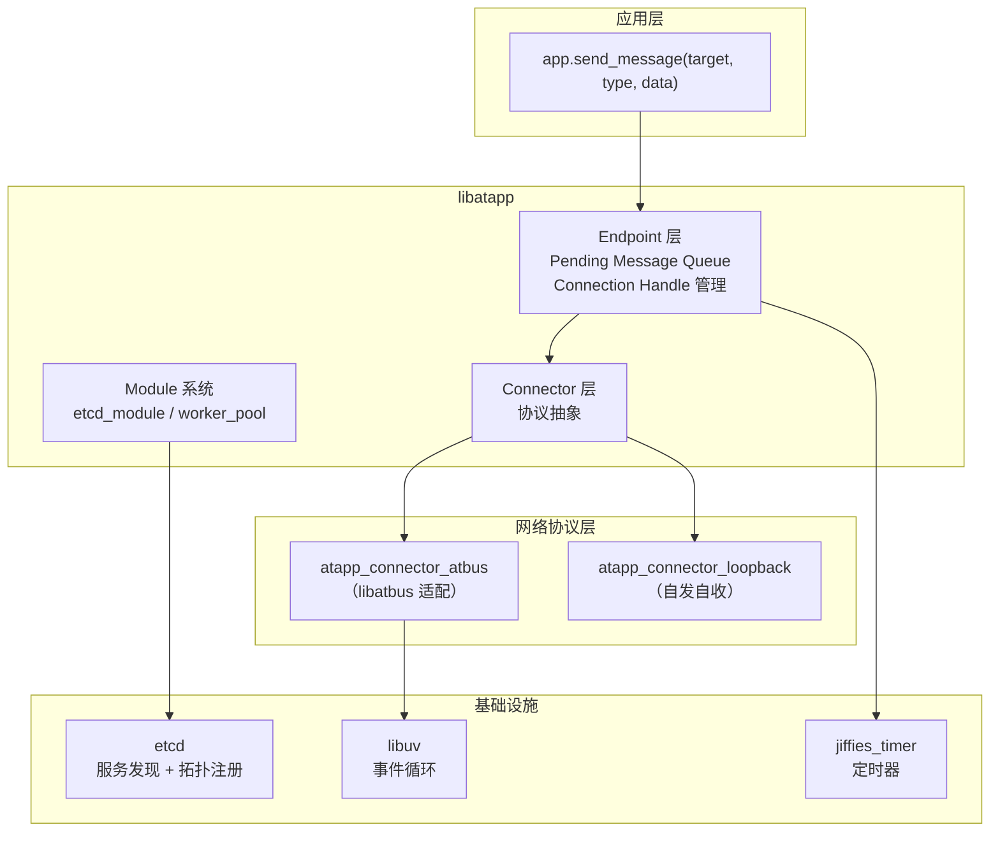
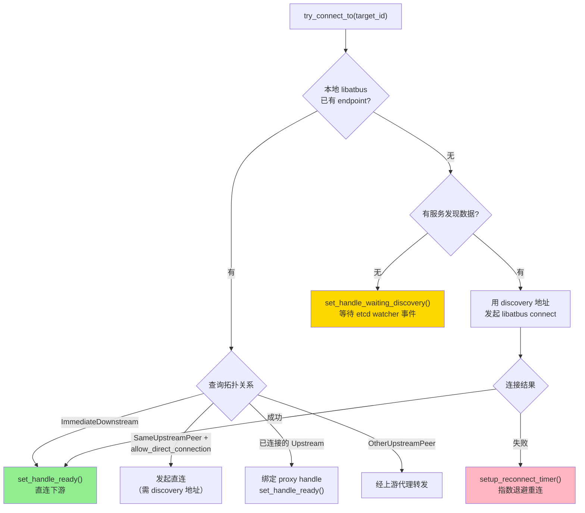
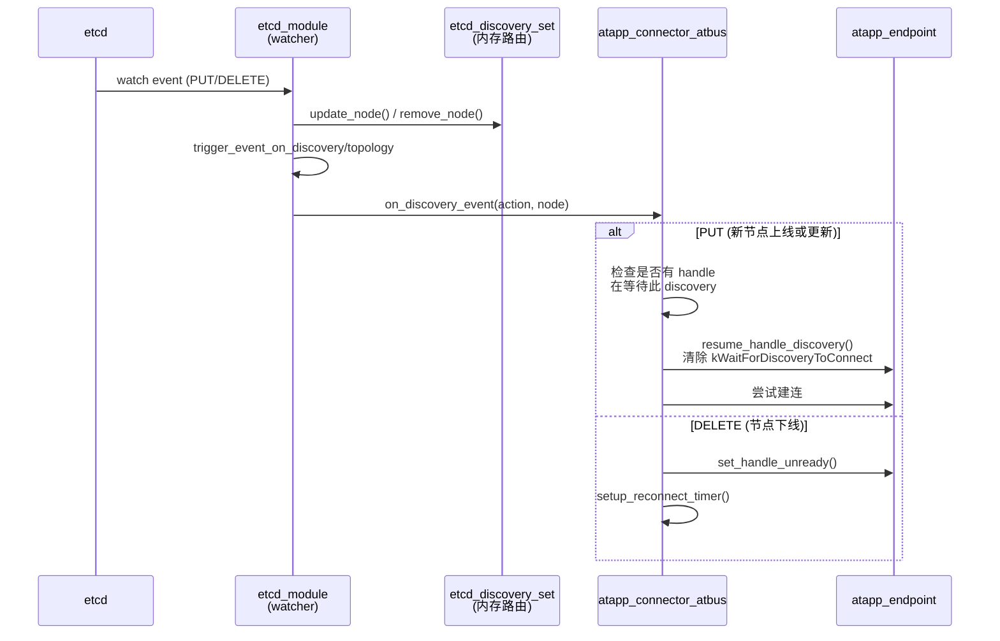
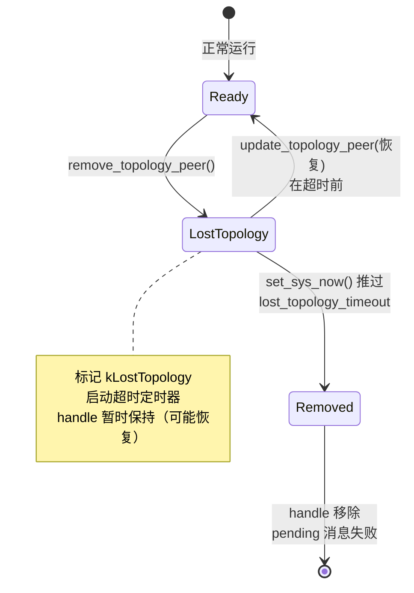
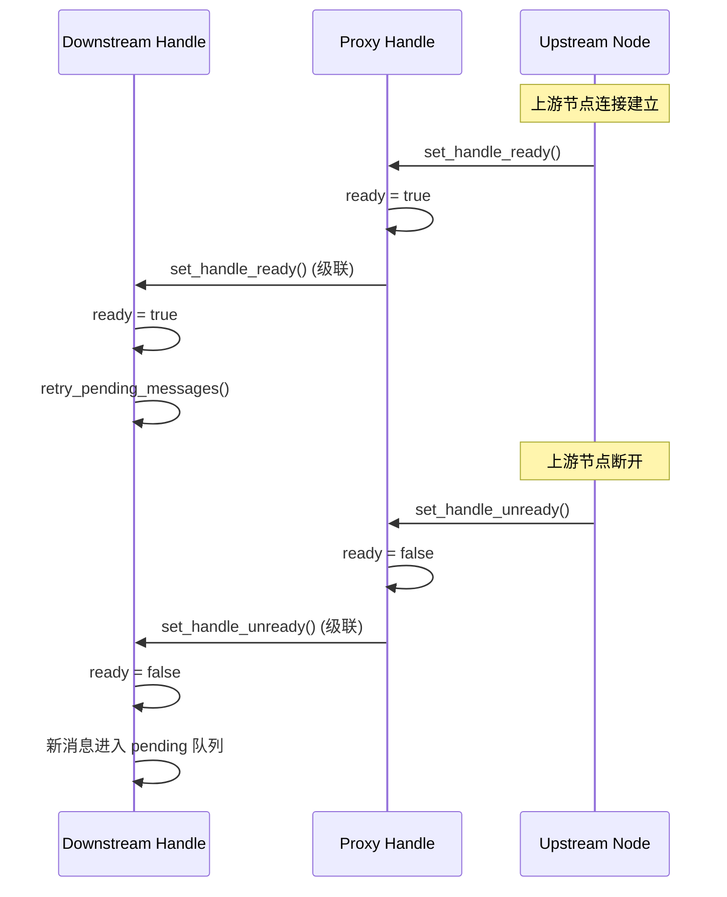

## 前言

在[上一篇文章][prev-post]中，介绍了 [libatbus][libatbus] 从静态子网树到动态拓扑注册表的路由设计变更。新的拓扑模型解决了代理层无法弹性伸缩和跨区域隔离的问题，但路由只是底层基座——上层应用框架 [libatapp][libatapp] 才是真正面对业务开发者的接口。

这篇文章聚焦于 [libatapp][libatapp] 在新架构下的连接管理层设计，涵盖以下核心问题：

- **Connector 抽象**：如何让多种网络协议（libatbus、loopback、未来的 gRPC）共用同一套连接管理逻辑？
- **Pending Message 排队**：连接尚未建立时，消息如何排队、何时重试、何时放弃？
- **etcd 双注册表**：服务发现和拓扑关系分两张表存 etcd，事件时序不一致时怎么处理？
- **拓扑变更响应**：上游切换、上游丢失、服务发现删除等场景下的自动恢复流程
- **重连机制**：指数退避、定时器替换策略、重试次数上限

如果你在做类似的分布式服务框架，或者在游戏服务器中面临过"网关/代理层 HPA 时消息丢失"的问题，这篇可能有参考价值。

## 总体架构

先给一个全景图，帮助理解各层的职责边界：



**核心设计原则**：

- [libatapp][libatapp] 的 Endpoint 和 Connection Handle 与 [libatbus][libatbus] 的 endpoint/connection 是 **两套独立的概念**。前者管理消息排队和连接状态，后者管理底层通道
- [libatbus][libatbus] 层只有 connection 级别的缓冲区，没有 message 级别的排队逻辑。所有 message 排队统一在 [libatapp][libatapp] 层完成
- 一个 libatapp endpoint 可以同时持有多个 connection handle（比如一条直连 + 一条经代理），但任何时刻只有一个是 ready 状态

## Connector 抽象层

### 设计动机

早期版本 [libatapp][libatapp] 和 [libatbus][libatbus] 是强绑定的，发消息就直接调 `atbus_node::send_data()`。但有几个场景推着我们做抽象：

1. **自发自收**：同一进程内的消息不需要经过网络栈，搞个 loopback connector 直接回调就行
2. **未来扩展**：有计划接入其他协议（如 gRPC），不想每次都把连接管理逻辑重写一遍
3. **Pending Message 复用**：不管底层是什么协议，"连接没建好时消息排队等待"这个逻辑是通用的

### Connector 接口

```cpp
class atapp_connector_impl {
  // 判断地址类型（ipv4/ipv6/shm/mem/loopback/...）
  virtual uint32_t get_address_type(const channel_address_t &addr) const = 0;
  
  // 发起连接
  virtual int32_t on_start_connect(const etcd_discovery_node &discovery,
                                   atapp_endpoint &endpoint,
                                   const channel_address_t &addr,
                                   const atapp_connection_handle::ptr_t &handle);
  
  // 发送数据
  virtual int32_t on_send_forward_request(atapp_connection_handle *handle,
                                          int32_t type, uint64_t *msg_sequence,
                                          gsl::span<const unsigned char> data,
                                          const atapp_metadata *metadata);
  
  // 响应服务发现事件
  virtual void on_discovery_event(etcd_discovery_action_t action,
                                  const etcd_discovery_node::ptr_t &node);
};
```

每种协议只需实现这几个接口，连接管理的上层逻辑（排队、重试、超时）全部在 Endpoint 层统一处理。

### atapp_connector_atbus: libatbus 适配器

这是最核心的 connector 实现，也是逻辑最复杂的部分。它需要：

- 把 libatapp 的"发给某个 target_id"翻译成 libatbus 的实际路由决策（直连、经代理、经上游转发）
- 追踪每个 connection handle 对应的 libatbus 链路状态
- 响应 libatbus 层的连接/断连/拓扑变更事件

每个 connection handle 内部维护一個 `atbus_connection_handle_data`：

```cpp
struct atbus_connection_handle_data {
  bus_id_t current_bus_id;               // 目标节点 ID
  bus_id_t topology_upstream_bus_id;     // 来自拓扑信息的上游 ID
  bus_id_t proxy_bus_id;                 // 当前实际走的代理节点 ID（0 = 直连）
  
  enum flags_t {
    kActiveConnection,              // 主动发起的连接
    kWaitForDiscoveryToConnect,     // 等待 etcd 服务发现数据到达
    kLostTopology,                  // 拓扑信息已丢失，等待超时清理
    kReady,                         // 连接就绪，可以发数据
  };
  
  uint32_t reconnect_retry_times;          // 当前重连累计次数
  raw_time_t reconnect_next_timepoint;     // 下次重连时间点
  jiffies_timer_watcher_t timer_handle;    // 关联的定时器（可撤销）
};
```

## 连接建立的路由决策

当 libatapp 需要和某个目标节点通信时，`atapp_connector_atbus` 的 `try_connect_to()` 会按以下优先级选择路径：



**关键行为**：

- 如果目标是自己的下游（ImmediateDownstream），并且 libatbus 层已经有这个 endpoint（对方主动连上来了），直接标记 ready
- 如果目标和自己挂在同一个上游（SameUpstreamPeer），且配置允许直连 (`allow_direct_connection: true`)，则尝试直连
- 如果无法直连或没有服务发现数据，通过上游代理转发
- 如果服务发现数据还没到，标记 `kWaitForDiscoveryToConnect` 并等待 etcd watcher 回调

## Pending Message 队列

### 排队机制

当消息发送时 endpoint 上没有 ready 的 connection handle，消息不会被丢弃，而是进入 `pending_message_` 队列：

```cpp
struct pending_message_t {
  int32_t type;
  uint64_t msg_sequence;
  std::vector<unsigned char> data;
  const atapp_metadata *metadata;
  raw_time_t expired_timepoint;     // 超时时间
};
```

排队有两道保护：

- **数量上限** (`send_buffer_number`)：防止内存暴涨
- **超时上限** (`message_timeout`)：默认 30 秒，过期的消息触发 `on_forward_response` 错误回调

### 重试触发

当 connection handle 状态切换为 ready 时（不管是新连接建立、重连成功、还是代理 handle 就绪），会调用 `endpoint.retry_pending_messages()`：

1. 从队列头部取消息
2. 检查是否过期，过期的移除并触发错误回调
3. 发送，成功则移除
4. 发送失败（如缓冲区满）则停止本轮重试，等下个 tick

重试是**增量的**，不会一次性把所有 pending 消息全部发出，避免瞬间打满网络缓冲区。

## etcd 双注册表: 服务发现 + 拓扑

### 两张表的分工

libatapp 通过 `etcd_module` 在 etcd 中维护两组 key：

| 注册表 | Key 路径模式 | 内容 | 用途 |
|--------|-------------|------|------|
| 服务发现 | `/atapp/services/<cluster>/by_id/<node_id>` | `atapp_discovery` protobuf：节点 ID、名字、地址列表、区域信息、metadata | 找到目标节点的网络地址，用于建连 |
| 拓扑关系 | `/atapp/topology/<cluster>/by_id/<node_id>` | `atapp_topology_info` protobuf：节点 ID、upstream_id、labels | 判定节点间的代理/直连关系 |

两组 key **绑到同一个 etcd lease** 上，节点下线时（lease 过期）两组 key 一起被 etcd 自动删除。

### 为什么分两张表

核心考虑是 **抖动隔离**：

- 代理层扩缩容或者网关迁移时，拓扑关系会频繁变更（upstream_id 变化）
- 如果拓扑数据和服务发现放在同一个 key 里，每次 proxy HPA 都会触发全量服务发现事件，导致业务层的路由缓存（一致性哈希分布、轮询计数器等）被无谓地刷新

分表后，拓扑变更只触发拓扑事件，不影响服务发现。业务层感知不到代理层的抖动。

### 写入顺序和短暂不一致

启动时的写入顺序是 **先拓扑，后服务发现**。这样其他节点收到某节点的服务发现事件时，该节点的拓扑信息通常已经就绪。

唯一的不一致窗口是两个 watcher 事件到达的间隔（通常在毫秒级）。如果在这个窗口内发送消息，会进入 pending 队列，等拓扑事件到达后自动重试。这个代价可以接受。

### Watcher 事件驱动

etcd_module 为服务发现和拓扑分别维护独立的 watcher。收到事件后的处理链路：



## 拓扑变更响应

这是整个连接管理中最复杂的部分。下面按场景分析。

### 场景一: 上游切换 (update_topology_peer)

当 etcd 拓扑 watcher 发现某节点的 `upstream_id` 从 A 变为 B：

1. 检查新上游 B 是否已有 libatbus endpoint（已连接）
2. 如果已连接：无缝切换 proxy_bus_id，handle 保持 ready，消息不中断
3. 如果未连接但有服务发现数据：发起连接，连接成功后切换
4. 如果未连接且无服务发现数据：标记 `kWaitForDiscoveryToConnect`，等事件到达

### 场景二: 上游丢失 (remove_topology_peer)



关键行为：

- 上游拓扑丢失后，handle **不立即关闭**，而是标记 `kLostTopology` 并启动超时定时器（默认 `lost_topology_timeout = 120s`）
- 如果在超时前收到新的 `update_topology_peer`，清除标记并恢复正常
- 如果超时后仍未恢复，强制移除 handle，所有 pending 消息以 `EN_ATBUS_ERR_NODE_TIMEOUT` 失败回调

这个"宽限期"设计对 rolling update 场景很重要：proxy 节点重启时，短暂的拓扑中断不应该导致下游全量消息失败。

### 场景三: 服务发现删除再恢复

一个特殊的场景是目标节点在 etcd 中短暂消失（如进程重启）：

1. 收到 discovery DELETE → connector 触发 `set_handle_unready`
2. 标记 `kWaitForDiscoveryToConnect`，启动重连定时器
3. 节点重启后服务发现重新上线 → `on_discovery_event(kPut)` 触发
4. `resume_handle_discovery()` 清除 `kWaitForDiscoveryToConnect`
5. 用新的 discovery 地址重新建连

## 重连机制

### 指数退避

重连定时器的间隔按指数递增：

$$\text{interval}(n) = \min(\text{start\_interval} \times 2^n, \text{max\_interval})$$

例如，配置 `start_interval = 2s, max_interval = 16s, max_try_times = 5`：

| 重试次数 | 间隔 | 累计等待 |
|----------|------|----------|
| 第 1 次 | 4s | 4s |
| 第 2 次 | 8s | 12s |
| 第 3 次 | 16s | 28s |
| 第 4 次 | 16s | 44s |
| 第 5 次 | — | 超限，移除 handle |

### 定时器替换策略

一个 handle 同一时刻只有一个 pending 定时器。当多个事件（如 `set_handle_unready` 和 `remove_topology_peer`）都想设定定时器时：

- **取更近的**：新定时器的超时时间比现有的更早 → 替换
- **跳过更远的**：新定时器比现有的更晚 → 保持原定时器

这避免了同一个 handle 上定时器不断积累的问题。

### 重试次数累积

每次重连失败 `reconnect_retry_times` 递增。但以下事件会重置计数器：

- 连接成功 → 归零
- 收到新的服务发现事件 → 归零
- `update_topology_peer` 切换上游 → 归零

这意味着一个 handle 如果经历了"失败 → 失败 → 上游切换 → 失败"的序列，重试计数从第三次失败重新开始。

## 代理级联传播

### Ready/Unready 级联

当一个节点充当代理（proxy）角色时，它自身的 connection handle 状态会级联传播给所有通过它路由的下游 handle：



### 代理移除级联

如果代理节点的 handle 被移除（如超时/GC），所有绑定到它的下游 handle 也会触发 `on_close_connection` 回调并被移除。

在实现上需要注意一个边界情况：如果下游 handle 先于代理 handle 被移除（如下游自己超时了），代理移除时的级联遍历要安全跳过已移除的下游。这里使用了 weak reference + 有效性检查来避免 dangling pointer。

## Endpoint 的 GC 机制

libatapp endpoint 的生命周期比 connection handle 长。当最后一个 connection handle 被移除后，endpoint 不会立即销毁，而是进入 GC 等待期：

1. 所有 handle 移除 → 设置 `gc_timepoint = now + gc_timeout`
2. 在 GC 等待期内，如果有新的 connection handle 进来（如重连成功），endpoint 恢复活跃
3. GC 超时后，endpoint 被真正销毁，其上的所有 pending message 以错误回调

这个机制避免了因短暂网络抖动导致 endpoint 反复创建/销毁的开销。

## 单元测试覆盖

这次重构的一个重点产出是完整的单元测试矩阵。测试框架使用项目私有测试框架，通过多节点拓扑 + `set_sys_now()` 虚拟时间推进来覆盖各种异步场景：

| 测试组 | 拓扑 | 覆盖场景 | 用例数 |
|--------|------|----------|--------|
| A 组 | node1 → upstream ← node3 | 上游转发、pending 排队、重连、超时 | 8 |
| B 组 | node1 → upstream ← node2 (直连) | 直连优先、discovery 等待、指数退避 | 8 |
| C 组 | upstream ← downstream | 下游连接、双向发送、断连恢复 | 4 |
| D 组 | node → old_upstream / new_upstream | 拓扑切换、丢失恢复、超时清理 | 9 |
| E 组 | node1 ↔ node2 | 服务发现生命周期、重连计数、定时器策略 | 5 |
| F 组 | node → proxy → downstream | 代理级联 ready/unready、代理移除 | 5 |

每个用例都验证了 **数据一致性**（发送内容和接收内容逐字节比对），而非只检查"收到了消息"。虚拟时间推进用于精确触发超时和重连，避免测试依赖真实时间导致的不稳定。

### 测试中踩的坑

几个值得记录的调试经验：

1. **多 app 共享 `uv_default_loop()`**：当多个 atapp 实例用 `init(nullptr, ...)` 初始化时，它们共享同一个 libuv 事件循环。调用任一 app 的 `run_noblock()` 会驱动所有 app 的 IO 回调。需要虚拟时间推进的阶段，应该用 `tick()` 而非 `run_noblock()`，避免跨 app 的定时器相互干扰。

2. **jiffies_timer 懒初始化**：`add_custom_timer()` 如果在第一次 `tick()` 前调用，jiffies_timer 还未初始化（`get_last_tick() == 0`），会导致 delta 计算溢出，返回 `EN_JTET_TIMEOUT_EXTENDED`。修复方式是在 `add_custom_timer()` 内部增加一次懒初始化。

3. **`set_sys_now()` 和定时器回调的交互**：虚拟时间跳跃后，定时器回调内部会用 `get_sys_now()` 计算下一个定时器的超时点。这意味着一次 `tick()` 只会触发一个中间定时器——需要多次 `set_sys_now() + tick()` 逐步推进才能触发连续的重连退避。

## 总结

libatapp 的连接管理层不是简单地"包一层 libatbus"，而是在 libatbus 的拓扑路由基座上构建了一套完整的连接生命周期管理：

- **Connector 抽象** 使得网络协议可插拔，pending message 排队逻辑只实现一次
- **etcd 双注册表** 隔离了代理层抖动对业务路由的影响
- **拓扑变更响应** 结合 `kLostTopology` 宽限期和 pending retry 机制，实现了对 rolling update 的平滑过渡
- **指数退避重连** 配合定时器替换策略，避免了重连风暴和定时器泄漏
- **代理级联传播** 通过 ready/unready 状态传递，让下游节点无需直接感知代理层的变化

整体设计的 trade-off 是用额外的状态机复杂度（connection handle 的多个 flags + 定时器管理）换来了对网络抖动和拓扑变更的自愈能力。从 111 个覆盖核心路径的单元测试来看，这个复杂度是可控的。

[libatbus]: https://github.com/atframework/libatbus
[libatapp]: https://github.com/atframework/libatapp
[prev-post]: ../2604
