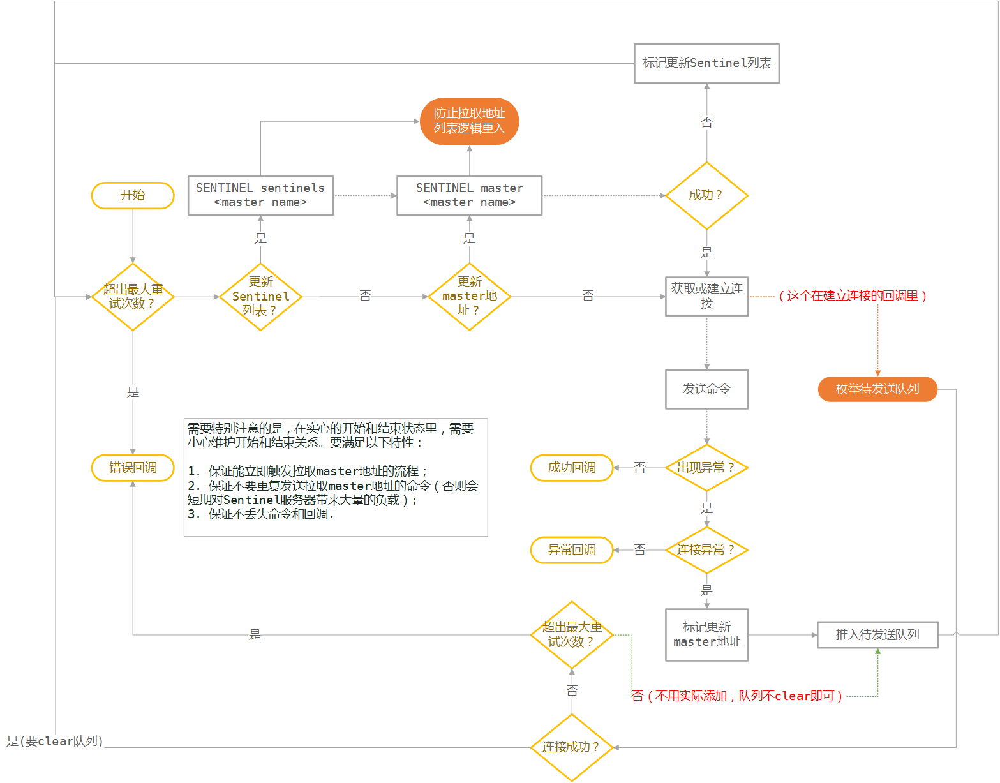

Redis全异步高可用Driver设计稿
======

<!-- toc -->

前言
------
现在Redis的集群功能已经Release。但是并没有一个官方直接提供的高可用性的API可以使用。有的只有解决方案，Sentinel和Cluster。所以有必要自己设计一套高可用的Driver层以供业务使用。

### Cluster
Redis 3.X已经release，这个版本提供了一个重要的功能，那就是集群（Cluster）。但是虽然redis的集群功能已经提供，但是目前还没有一个非常成熟的操作Redis集群的连接driver。而在我们游戏项目中，会需要一个稳健的driver来屏蔽底层细节，并且必须要使用全异步接口。

在开始前，我在某个论坛里看到[cpp-hiredis-cluster](https://github.com/shinberg/cpp-hiredis-cluster) 对redis的cluster支持得不错，就先大概看了一下[cpp-hiredis-cluster](https://github.com/shinberg/cpp-hiredis-cluster) 的实现，发现了几个问题。

1. 第一次连接集群节点采用的是同步操作，不过只有第一次是这样，问题也不大。
2. 执行**redisAsyncConnect**函数以后并没有关心是否连接成功，也就是说，即便连接失败了，连接仍然保存到了连接池中。
3. 没有关心断线的情况，也就是说，如果连接断开了，既不会重连，也不可能发送成功。
4. 没有支持slaver，也没有关心断线问题，如果master挂了，就没有然后了。
5. **retry**机制有问题，我看到的逻辑大概是这样：如果发现CLUSTERDOWN消息，则重试，并且是立即重试。并且重试的时候仍然用了原来的连接（还是没支持slaver导致的）。一般情况下，集群出现故障的时候必然会有一定的恢复时间，并且按照redis的规则，会把slaver节点提升会master，立即用原来的master连接重试毫无意义。
6. 每次检测到MOVE或者ASK消息都创建了一个新redis context，其实可以重用已有的。
7. 它里面使用了std::map来保存slot到redis context的映射关系，key是一个slot区间。搜索算法是找到第一个最小区间满足要求的slot。再加上上一条问题，导致redis如果在做扩容，原先已经失效的索引仍然存在，并且之后对这个key一定每次都会收到MOVED消息，然后每次都重新创建redis context和新连接，并覆盖原先的连接，并且覆盖先没有释放前一个redis context，造成严重的资源泄露。

总而言之，实现得很渣渣，所以还是需要自己维护一个连接redis cluster的工具。

### Sentinel

有一些服务，其实不需要Cluster那么复杂的操作。比如积分排行榜，直接主+备就够了。而要做到这方面数据安全，还是需要Sentinel来监控。

要解决的问题
------
1. 支持自动断线重连；
2. Redis Cluster不支持多个DB分区（一定要用DB0）并且最好对于不同类型业务可以部署在不同集群里，以便减少不同模块之间的影响，所以也需要提供多集群功能（类似SQL中的多个数据库）；
3. 要支持对Cluster的监控和统计；
4. 要支持多个通道（Channel）的设计（类似Redis的多个DB库）要实现不同通道之间完全隔离。

Redis-Cluster适配设计
------

### Redis-Cluster环境条件
1. 因为Slot只有16384(16K)个,即便把所有的Slot按Index放在数组里缓存也不会消耗太大的内存，并且这样查找是O(1)的
2. 尽量减少类似MSET的多key指令使用（包括涉及多个key的脚本），因为可能不同的Key会分布在不同的Slot上。在使用Cluster时，涉及多个key的指令，这些key必须拥有相同的hash值或hash tag，详见 http://redis.io/topics/cluster-tutorial#migrating-to-redis-cluster 
3. 要内部完成 **指令跳转和重试** - 需要自动处理MOVED命令、ASK命令和TRYAGAIN错误
> **MOVED** 命令出现在扩容和故障迁移时。这时候要永久更换Slot对应的连接。
> **ASK** 表示临时跳转。仅仅这一次消息使用新的连接。比如正在扩容的过程中（某个slot由A转向了B），数据可能还没全部转移完，那么访问A节点的这个slot时，可能找不到数据，这时候ASK跳转可以把目标指向当前有数据的节点（B）。
> ASK跳转还有一个特别的步骤是客户端先要发送一个**ASKING**命令，然后再重发这次的命令，不然处于导入转态的槽会被拒绝访问
> 在重新分片过程中的多个键值操作核能导致**TRYAGAIN**错误，这时候需要尝试重发命令
> 

4. 基本操作参考[redis-rb-cluster](https://github.com/antirez/redis-rb-cluster)这是redis作者写得ruby版本支持redis的cluster的driver

### [redis-rb-cluster](https://github.com/antirez/redis-rb-cluster) 分析
redis作者建议对cluster的支持仿照[redis-rb-cluster](https://github.com/antirez/redis-rb-cluster) 进行，那么我们来对这个库的实现流程做一个简单的分析。

1. 首先， [redis-rb-cluster](https://github.com/antirez/redis-rb-cluster) 和我们上面想得一样，是缓存了16384个槽。
2. 它实现了按需连接，就是说当第一次连接某个server时，仅仅会拉取Slot和服务器的关系列表，并没有真正建立连接，而是等第一次需要这个连接的时候才建立连接。
3. 限制了最大重定向次数，防止重定向死循环
4. 按需连接的时候，如果出现超时、连接被拒绝、连接失败的错误0.1秒后重试
5. 如果按slot查找连接没找到，则会返回一个随机的连接，然后根据ASK或者MOVED跳转来处理
6. ASK和MOVED跳转都会启动拉取所有Slot信息的行为，来更新Slot缓存
7. 拥有最大连接数限制，如果新建连接的时候超出最大连接数，随机关闭一个连接

执行Redis指令流程:

 
### 设计要点

[redis-rb-cluster](https://github.com/antirez/redis-rb-cluster) 写得确实比较漂亮，简单清晰。连我这种完全不懂ruby的人都能看懂。但是他的实现是全同步的操作。我们这里要求全异步操作时就会更加麻烦一点。

+ 首先是整个操作过程可以直接使用hiredis，使用起来比较简单，全程单线程，避免不必要的加解锁和逻辑复杂度；
+ 其次所有操作都要转为异步模式，因为不能预估操作的流程，所以还必须增加一层调用包装，用来包裹指令数据，这点和[cpp-hiredis-cluster](https://github.com/shinberg/cpp-hiredis-cluster)的Command一样；
+ 然后，要增加集群Server的概念，以便用一套接口操纵多个集群。这样的话，所有的数据结构中不能出现单例；
+ 直接利用hiredis的adapter来做事件绑定，方便工具迁移；
+ 使用**redisFormatSdsCommandArgv**和**redisAsyncFormattedCommand**来保存命令和执行命令（和[cpp-hiredis-cluster](https://github.com/shinberg/cpp-hiredis-cluster)一致）执行的命令保存为Sds后放到**Command**的数据包装里；
+ 为保证简单，我们的driver也可以使用主循环的模式（和 [redis-rb-cluster](https://github.com/antirez/redis-rb-cluster) 一样）。因为出现异常的情况会是少数，而正常的情况下，主循环只会执行一个循环；
+ 同样，是用主循环就需要设定最大循环次数，并且失败次数过高时休眠一段时间，用以避免逻辑死循环；
+ 使用按需建立连接，全局只保存**Slot-服务器地址缓存**和**服务器地址-连接池缓存**；
+ hiredis里大量使用了malloc，所以还是必须上jemalloc或者tcmalloc才比较靠谱；
+ 第一次连上以后应该像[redis-rb-cluster](https://github.com/antirez/redis-rb-cluster)发送一次拉取所有Slot信息的操作；
+ 某些命令和[redis-rb-cluster](https://github.com/antirez/redis-rb-cluster)一样，随机选取发送目标。
 
最后有一个要特别注意的是**丢包和超时**。

1. 丢包问题：虽然说TCP连接能保证数据包的顺序和并且自带网络包重发，但是在**连接断开的时候仍然会出现丢包**的情况。
2. 超时问题：hiredis的异步API里没有超时的判定，但是因为TCP包底层的重传机制，超时只有一种可能，那就是连接断开。然后要么是上面提到的情况，没有发送成功，要么是回包丢失。

无论上诉哪种情况，都会导致连接异常。根据对hiredis源代码的分析，（除了subscribe和unsubscribe命令外）这时候hiredis一定会回调所有没有完成的callback，然后响应disconnect事件，并且这时候redisReply *reply=NULL。
> subscribe和unsubscribe命令外，订阅命令的回调是个字典
> 
> subscribe命令的回调会在每次收到消息的时候都调用

**上层应用逻辑需要自己有一个超时机制和对超时后又收到回包的容错机制**。

### 定时器
由于异步API不允许sleep操作，所以所有延迟操作都应该在定时器回调中执行。然而为了保证像hiredis一样支持多种binding机制，只能由使用方来创建和设置定时器回调，并**在回调中调用提供的proc方法**。

为了简化设计，我们定义以下规则：

1. 所有定时器的间隔一致（定时器队列可以直接链表实现）；
2. 每个Channel有自己的定时器，并且定时器接口调用至少一次以后才会开启带定时器的功能（例如：sleep）；
3. 假设系统中的Channel数量不会很多，这样定时器就不会很多，性能开销比较小。

### 连接和重连等待

异步操作的另一个问题是连接和重连的时候的等待问题，因为在连接完成期间，可能会收到新的命令请求。hiredis的做法是每次来了一个请求以后就放到缓冲区里，并且在Context可写时立即写出。

我们这里可以直接利用它的这个机制。但是在重新拉取并建立Slot缓存的时候，没有Redis连接可以用于保存，命令，所以可以在Channel里使用一个链表保存更新完Slot缓存后的执行命令集。

然后额外需要做的就是支持断线后的重连功能了。

### 设计总结
简单地说，就是需要在hiredis上包一层，来完成对Cluster中的内部操作。实现的过程中会导致多一次malloc和多一次sds复制操作。流程图如下：

Sentinel适配设计
------

### 设计思路
Sentinel比较简单，大体上和Cluster一致，有几个不一样的地方如下:

1. 第一次连接的是Sentinel节点而不是数据节点；
2. 连接的Channel要附带<master name>，并且要通过**SENTINEL sentinels <master name>**拉取并连接Sentinel；
3. 连接完毕后需要先通过**SENTINEL master <master name>**拉取master数据；
4. 发送失败的重试流程是重新走**SENTINEL master <master name>**拉取master；
5. **SENTINEL master <master name>**失败和Sentinel连接出现问题需要先执行***2***，再重试；
6. 由于Sentinel拉取master地址之前，还不能建立到master的连接，所以Channel里要保存需要发送的命令Sds队列，并等待连接成功后发送。如果Sential连接失败或者拉取不到服务器地址，要执行回调并出错。

### 更进一步
1. 更好的实现方式是可以订阅Sentinel，从而更快地响应故障转移；
2. 读操作在配置允许的情况下可以走slave，以减小master压力；
3. Sentinel的连接可以共享。（这里貌似会涉及到单例管理器）。

不过这些功能可选，以后可以有时间再加。

### 设计总结
流程图如下：

集群健康报告
------
对于Cluster而言，使用**CLUSTER \* **命令就可以完成这些功能，并且总是随机取发送目标。

对于Sentinel而言，Sentinel提供了简单地方式获取master的状态。要获取更详细的信息，可能得用比较麻烦的方法，一次访问多个master和slaves（这里没仔细研究，以后再看）

另外Driver层可以提供一些事件给上层用于统计重连、断线等情况。

写在最后
------

整体上最重要的思路就是用主循环来简化逻辑复杂度。而主循环增加的那部分CPU消耗几乎可以忽略，不过这种异步传参方式对应着大量的malloc操作，以后看需要可以优化成c++ allocator的机制，这样就能支持自定义内存池。

流程图中建立连接后的命令发送流程比较特别，因为hiredis的异步发送接口是向缓冲区中添加数据，并且等fd可写后才实际执行，所以可以不等connect完成就直接调用发送接口。

另外Cluster更新服务器连接池的方式比较讨巧，既能避免频繁更新地址池，又可以及时更新Slot缓存，需要注意一下。

以上思路我会先在 https://github.com/owt5008137/hiredis-happ 中进行实现和测试，然后用于生产环境。

> Written with [StackEdit](https://stackedit.io/).
