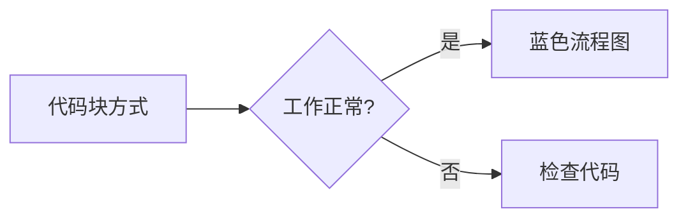

# Diagram & Chart Rendering Demo

This page demonstrates all supported methods for rendering diagrams and charts:
- **Draw.io** - `.drawio` files
- **Mermaid** - `.mermaid` files
- **Excalidraw** - `.excalidraw` files  
- **Chart.js** - `.chart.json` files
- **ECharts** - `.echarts.json` files
- **Plotly.js** - `.plotly.json` files

Each format supports 4 usage methods:
1. Image syntax: ``
2. Code block: ` ```language `
3. Shortcode with src: ``
4. Shortcode inline: `content`

---

## 1. Draw.io 测试

### 1.1 图片语法引用 .drawio 文件

下面是通过图片语法引用的 draw.io 图表：


### 1.2 代码块方式（内嵌XML）

```drawio
<mxfile host="app.diagrams.net">
  <diagram name="Page-1" id="codeblock-test">
    <mxGraphModel dx="800" dy="400" grid="1" gridSize="10" guides="1" tooltips="1" connect="1" arrows="1" fold="1" page="1" pageScale="1" pageWidth="827" pageHeight="1169">
      <root>
        <mxCell id="0" />
        <mxCell id="1" parent="0" />
        <mxCell id="2" value="代码块方式" style="rounded=1;whiteSpace=wrap;html=1;fillColor=#dae8fc;strokeColor=#6c8ebf;fontSize=14;fontStyle=1" vertex="1" parent="1">
          <mxGeometry x="40" y="40" width="120" height="50" as="geometry" />
        </mxCell>
      </root>
    </mxGraphModel>
  </diagram>
</mxfile>
```

### 1.3 Shortcode 引用外部文件



### 1.4 Shortcode 内联方式


<mxfile host="app.diagrams.net">
  <diagram name="Page-1" id="shortcode-inline-test">
    <mxGraphModel dx="800" dy="400" grid="1" gridSize="10" guides="1" tooltips="1" connect="1" arrows="1" fold="1" page="1" pageScale="1" pageWidth="827" pageHeight="1169">
      <root>
        <mxCell id="0" />
        <mxCell id="1" parent="0" />
        <mxCell id="2" value="Shortcode 内联" style="rounded=1;whiteSpace=wrap;html=1;fillColor=#d5e8d4;strokeColor=#82b366;fontSize=14;fontStyle=1" vertex="1" parent="1">
          <mxGeometry x="40" y="40" width="120" height="50" as="geometry" />
        </mxCell>
      </root>
    </mxGraphModel>
  </diagram>
</mxfile>


---

## 2. Mermaid 图片语法测试

### 2.1 图片语法引用 .mermaid 文件

下面是通过图片语法引用的 mermaid 图表：


### 2.2 代码块方式



### 2.3 Shortcode 引用外部文件



### 2.4 Shortcode 内联方式


graph TD
    A[Shortcode 内联] --> B[Mermaid 图表]
    B --> C{正常显示?}
    C -->|是| D[成功]
    C -->|否| E[检查]


---

## 3. Excalidraw 图片语法测试

### 3.1 图片语法引用 .excalidraw 文件

下面是通过图片语法引用的 excalidraw 图表：


### 3.2 Shortcode 引用外部文件



### 3.3 Shortcode 内联方式


{
  "type": "excalidraw",
  "version": 2,
  "source": "https://excalidraw.com",
  "elements": [
    {
      "id": "shortcode-inline-rect",
      "type": "rectangle",
      "x": 100,
      "y": 100,
      "width": 180,
      "height": 80,
      "angle": 0,
      "strokeColor": "#2f9e44",
      "backgroundColor": "#b2f2bb",
      "fillStyle": "solid",
      "strokeWidth": 2,
      "roughness": 1,
      "opacity": 100,
      "seed": 11111,
      "version": 1,
      "versionNonce": 1
    },
    {
      "id": "shortcode-inline-text",
      "type": "text",
      "x": 115,
      "y": 125,
      "width": 150,
      "height": 30,
      "angle": 0,
      "strokeColor": "#1e1e1e",
      "backgroundColor": "transparent",
      "fillStyle": "solid",
      "strokeWidth": 1,
      "roughness": 1,
      "opacity": 100,
      "seed": 22222,
      "version": 1,
      "versionNonce": 1,
      "text": "Shortcode 内联",
      "fontSize": 18,
      "fontFamily": 1,
      "textAlign": "center",
      "verticalAlign": "middle"
    }
  ],
  "appState": {
    "viewBackgroundColor": "#ffffff"
  }
}


### 3.4 代码块方式

```excalidraw
{
  "type": "excalidraw",
  "version": 2,
  "source": "https://excalidraw.com",
  "elements": [
    {
      "id": "codeblock-rect",
      "type": "rectangle",
      "x": 100,
      "y": 100,
      "width": 200,
      "height": 100,
      "angle": 0,
      "strokeColor": "#1971c2",
      "backgroundColor": "#a5d8ff",
      "fillStyle": "solid",
      "strokeWidth": 2,
      "roughness": 1,
      "opacity": 100,
      "seed": 54321,
      "version": 1,
      "versionNonce": 1
    },
    {
      "id": "codeblock-text",
      "type": "text",
      "x": 130,
      "y": 135,
      "width": 140,
      "height": 30,
      "angle": 0,
      "strokeColor": "#1e1e1e",
      "backgroundColor": "transparent",
      "fillStyle": "solid",
      "strokeWidth": 1,
      "roughness": 1,
      "opacity": 100,
      "seed": 65432,
      "version": 1,
      "versionNonce": 1,
      "text": "代码块方式",
      "fontSize": 20,
      "fontFamily": 1,
      "textAlign": "center",
      "verticalAlign": "middle"
    }
  ],
  "appState": {
    "viewBackgroundColor": "#ffffff"
  }
}
```

---

## 4. Chart.js 测试

### 4.1 图片语法引用 .chart.json 文件

下面是通过图片语法引用的 Chart.js 图表：


### 4.2 Shortcode 引用外部文件



### 4.3 Shortcode 内联方式


{
  "type": "doughnut",
  "data": {
    "labels": ["Red", "Blue", "Yellow"],
    "datasets": [{
      "data": [300, 50, 100],
      "backgroundColor": ["#FF6384", "#36A2EB", "#FFCE56"]
    }]
  },
  "options": {
    "responsive": true,
    "plugins": {
      "title": {
        "display": true,
        "text": "Shortcode 内联图表"
      }
    }
  }
}


### 4.4 代码块方式

```chart
{
  "type": "line",
  "data": {
    "labels": ["周一", "周二", "周三", "周四", "周五"],
    "datasets": [{
      "label": "访问量",
      "data": [65, 59, 80, 81, 56],
      "fill": false,
      "borderColor": "rgb(75, 192, 192)",
      "tension": 0.1
    }]
  },
  "options": {
    "responsive": true,
    "plugins": {
      "title": {
        "display": true,
        "text": "代码块方式图表 (chart)"
      }
    }
  }
}
```

### 4.5 代码块方式 (chartjs 语法)

```chartjs
{
  "type": "pie",
  "data": {
    "labels": ["Chrome", "Firefox", "Safari", "Edge"],
    "datasets": [{
      "data": [60, 20, 10, 10],
      "backgroundColor": ["#4285F4", "#FF7139", "#00D084", "#0078D7"]
    }]
  },
  "options": {
    "responsive": true,
    "plugins": {
      "title": {
        "display": true,
        "text": "代码块方式图表 (chartjs)"
      }
    }
  }
}
```

---

## 5. ECharts 测试

ECharts 的扩展是增量式的：默认只加载核心包（含所有 2D 图表），需要 3D 时通过 `extensions="gl"` 追加 `echarts-gl`。下面分别用 2D 数学函数图 `y = sin(x)` 和 3D 曲面图 `z = sin(sqrt(x^2 + y^2))` 覆盖四种引入方式。

### 5.1 图片语法引用 .echarts.json（2D 数学函数）


### 5.2 代码块方式（2D 数学函数）

```echarts
{
  "title": { "text": "y = sin(x)", "left": "center" },
  "tooltip": { "trigger": "axis" },
  "xAxis": { "type": "value", "name": "x", "min": 0, "max": 6.283 },
  "yAxis": { "type": "value", "name": "y", "min": -1.1, "max": 1.1 },
  "series": [{ "type": "line", "showSymbol": false, "smooth": true, "data": [[0.000,0.000], [0.262,0.259], [0.524,0.500], [0.785,0.707], [1.047,0.866], [1.309,0.966], [1.571,1.000], [1.833,0.966], [2.094,0.866], [2.356,0.707], [2.618,0.500], [2.880,0.259], [3.142,0.000], [3.403,-0.259], [3.665,-0.500], [3.927,-0.707], [4.189,-0.866], [4.451,-0.966], [4.712,-1.000], [4.974,-0.966], [5.236,-0.866], [5.498,-0.707], [5.760,-0.500], [6.021,-0.259], [6.283,0.000]] }]
}
```

### 5.3 Shortcode 引用外部文件（3D 曲面，gl 扩展）



### 5.4 Shortcode 内联方式（3D 曲面，gl 扩展）


{
  "title": { "text": "z = sin(sqrt(x^2 + y^2))", "left": "center" },
  "tooltip": {},
  "xAxis3D": { "type": "value" },
  "yAxis3D": { "type": "value" },
  "zAxis3D": { "type": "value" },
  "grid3D": { "viewControl": { "autoRotate": true } },
  "series": [{ "type": "surface", "wireframe": { "show": false }, "data": [[-3.0,-3.0,-0.892], [-3.0,-2.4,-0.644], [-3.0,-1.8,-0.349], [-3.0,-1.2,-0.089], [-3.0,-0.6,0.082], [-3.0,0.0,0.141], [-3.0,0.6,0.082], [-3.0,1.2,-0.089], [-3.0,1.8,-0.349], [-3.0,2.4,-0.644], [-3.0,3.0,-0.892], [-2.4,-3.0,-0.644], [-2.4,-2.4,-0.250], [-2.4,-1.8,0.141], [-2.4,-1.2,0.442], [-2.4,-0.6,0.619], [-2.4,0.0,0.675], [-2.4,0.6,0.619], [-2.4,1.2,0.442], [-2.4,1.8,0.141], [-2.4,2.4,-0.250], [-2.4,3.0,-0.644], [-1.8,-3.0,-0.349], [-1.8,-2.4,0.141], [-1.8,-1.8,0.561], [-1.8,-1.2,0.830], [-1.8,-0.6,0.947], [-1.8,0.0,0.974], [-1.8,0.6,0.947], [-1.8,1.2,0.830], [-1.8,1.8,0.561], [-1.8,2.4,0.141], [-1.8,3.0,-0.349], [-1.2,-3.0,-0.089], [-1.2,-2.4,0.442], [-1.2,-1.8,0.830], [-1.2,-1.2,0.992], [-1.2,-0.6,0.974], [-1.2,0.0,0.932], [-1.2,0.6,0.974], [-1.2,1.2,0.992], [-1.2,1.8,0.830], [-1.2,2.4,0.442], [-1.2,3.0,-0.089], [-0.6,-3.0,0.082], [-0.6,-2.4,0.619], [-0.6,-1.8,0.947], [-0.6,-1.2,0.974], [-0.6,-0.6,0.750], [-0.6,0.0,0.565], [-0.6,0.6,0.750], [-0.6,1.2,0.974], [-0.6,1.8,0.947], [-0.6,2.4,0.619], [-0.6,3.0,0.082], [0.0,-3.0,0.141], [0.0,-2.4,0.675], [0.0,-1.8,0.974], [0.0,-1.2,0.932], [0.0,-0.6,0.565], [0.0,0.0,0.000], [0.0,0.6,0.565], [0.0,1.2,0.932], [0.0,1.8,0.974], [0.0,2.4,0.675], [0.0,3.0,0.141], [0.6,-3.0,0.082], [0.6,-2.4,0.619], [0.6,-1.8,0.947], [0.6,-1.2,0.974], [0.6,-0.6,0.750], [0.6,0.0,0.565], [0.6,0.6,0.750], [0.6,1.2,0.974], [0.6,1.8,0.947], [0.6,2.4,0.619], [0.6,3.0,0.082], [1.2,-3.0,-0.089], [1.2,-2.4,0.442], [1.2,-1.8,0.830], [1.2,-1.2,0.992], [1.2,-0.6,0.974], [1.2,0.0,0.932], [1.2,0.6,0.974], [1.2,1.2,0.992], [1.2,1.8,0.830], [1.2,2.4,0.442], [1.2,3.0,-0.089], [1.8,-3.0,-0.349], [1.8,-2.4,0.141], [1.8,-1.8,0.561], [1.8,-1.2,0.830], [1.8,-0.6,0.947], [1.8,0.0,0.974], [1.8,0.6,0.947], [1.8,1.2,0.830], [1.8,1.8,0.561], [1.8,2.4,0.141], [1.8,3.0,-0.349], [2.4,-3.0,-0.644], [2.4,-2.4,-0.250], [2.4,-1.8,0.141], [2.4,-1.2,0.442], [2.4,-0.6,0.619], [2.4,0.0,0.675], [2.4,0.6,0.619], [2.4,1.2,0.442], [2.4,1.8,0.141], [2.4,2.4,-0.250], [2.4,3.0,-0.644], [3.0,-3.0,-0.892], [3.0,-2.4,-0.644], [3.0,-1.8,-0.349], [3.0,-1.2,-0.089], [3.0,-0.6,0.082], [3.0,0.0,0.141], [3.0,0.6,0.082], [3.0,1.2,-0.089], [3.0,1.8,-0.349], [3.0,2.4,-0.644], [3.0,3.0,-0.892]] }]
}


---

## 6. Plotly.js 测试

Plotly.js 的 partial bundle（basic / gl3d / cartesian 等）互相覆盖全局 `Plotly`，无法叠加。因此加载策略是：默认只加载最小包（`plotly-basic`，含 scatter/bar/pie）；当页面里同时出现最小特性图表和声明了扩展的图表（如 3D 的 `extensions="gl3d"`）时，自动升级到完整包。

### 6.1 图片语法引用 .plotly.json（2D 数学函数）


### 6.2 代码块方式（2D 数学函数）

```plotly
{
  "data": [{ "type": "scatter", "mode": "lines", "name": "sin(x)", "x": [0.000, 0.262, 0.524, 0.785, 1.047, 1.309, 1.571, 1.833, 2.094, 2.356, 2.618, 2.880, 3.142, 3.403, 3.665, 3.927, 4.189, 4.451, 4.712, 4.974, 5.236, 5.498, 5.760, 6.021, 6.283], "y": [0.000, 0.259, 0.500, 0.707, 0.866, 0.966, 1.000, 0.966, 0.866, 0.707, 0.500, 0.259, 0.000, -0.259, -0.500, -0.707, -0.866, -0.966, -1.000, -0.966, -0.866, -0.707, -0.500, -0.259, 0.000], "line": { "width": 2 } }],
  "layout": { "title": "y = sin(x)", "xaxis": { "title": "x" }, "yaxis": { "title": "y", "range": [-1.1, 1.1] } }
}
```

### 6.3 Shortcode 引用外部文件（3D 曲面，gl3d 扩展）



### 6.4 Shortcode 内联方式（3D 曲面，gl3d 扩展）


{
  "data": [{ "type": "surface", "x": [-3, -2.25, -1.5, -0.75, 0, 0.75, 1.5, 2.25, 3], "y": [-3, -2.25, -1.5, -0.75, 0, 0.75, 1.5, 2.25, 3], "z": [[-0.892, -0.572, -0.211, 0.049, 0.141, 0.049, -0.211, -0.572, -0.892], [-0.572, -0.040, 0.424, 0.696, 0.778, 0.696, 0.424, -0.040, -0.572], [-0.211, 0.424, 0.852, 0.994, 0.997, 0.994, 0.852, 0.424, -0.211], [0.049, 0.696, 0.994, 0.873, 0.682, 0.873, 0.994, 0.696, 0.049], [0.141, 0.778, 0.997, 0.682, 0.000, 0.682, 0.997, 0.778, 0.141], [0.049, 0.696, 0.994, 0.873, 0.682, 0.873, 0.994, 0.696, 0.049], [-0.211, 0.424, 0.852, 0.994, 0.997, 0.994, 0.852, 0.424, -0.211], [-0.572, -0.040, 0.424, 0.696, 0.778, 0.696, 0.424, -0.040, -0.572], [-0.892, -0.572, -0.211, 0.049, 0.141, 0.049, -0.211, -0.572, -0.892]] }],
  "layout": { "title": "z = sin(sqrt(x^2 + y^2))", "scene": { "xaxis": {"title":"x"}, "yaxis": {"title":"y"}, "zaxis": {"title":"z"} } }
}


---

## 7. 测试结果

| 类型 | 图片语法 | 代码块方式 | Shortcode (内联) | Shortcode (src) |
|------|---------|-----------|-----------------|-----------------|
| Draw.io | ✓ `.drawio` | ✓ `drawio` | ✓ | ✓ |
| Mermaid | ✓ `.mermaid` | ✓ `mermaid` | ✓ | ✓ |
| Excalidraw | ✓ `.excalidraw` | ✓ `excalidraw` | ✓ | ✓ |
| Chart.js | ✓ `.chart.json` | ✓ `chart` / `chartjs` | ✓ | ✓ |
| ECharts | ✓ `.echarts.json` | ✓ `echarts` | ✓ | ✓ |
| Plotly.js | ✓ `.plotly.json` | ✓ `plotly` | ✓ | ✓ |

如果所有图表都能正常显示，说明功能正常工作！
